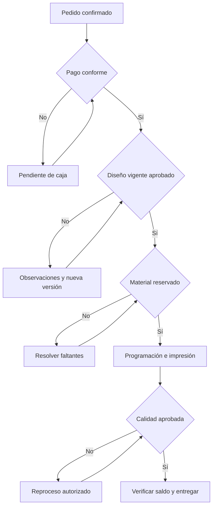

# Flujo operativo

## Recorrido de un pedido

| Paso | Responsable | Trabajo y resultado |
|---|---|---|
| 1 | Cliente | Elige servicios, configura especificaciones y envía el carrito como solicitud |
| 2 | Ventas | Revisa factibilidad, tarifas, archivos disponibles y plazo; emite proforma |
| 3 | Cliente | Consulta el PDF vigente; acepta o rechaza las condiciones |
| 4 | SIGIP | Registra aceptación y crea el pedido una sola vez, con copia de precios y condiciones |
| 5 | Caja | Verifica adelanto o condición comercial aprobada |
| 6 | Diseño y cliente | Presentan prueba digital; cliente observa o aprueba la versión exacta |
| 7 | Almacén | Reserva materiales según ficha técnica y cantidad; reporta faltantes |
| 8 | Producción | Verifica todos los requisitos y programa la orden de trabajo |
| 9 | Operario | Registra impresión, acabados y consumo real |
| 10 | Calidad | Aprueba o devuelve a reproceso con motivo |
| 11 | Caja y entregas | Verifican saldo, registran receptor y cierran la entrega |

Pago, diseño y disponibilidad son condiciones independientes; pueden resolverse en paralelo. El pedido muestra qué falta, en vez de asumir que pagar significa estar listo para imprimir.

El diagrama representa las comprobaciones para liberar el trabajo; no obliga a esperar el pago para empezar una revisión de archivo, si la política comercial permite esa revisión.

## Estados separados

| Objeto | Estados principales |
|---|---|
| Proforma | BORRADOR, EMITIDA, ACEPTADA, RECHAZADA, VENCIDA, SUSTITUIDA |
| Pedido | CONFIRMADO, EN_PREPARACION, PROGRAMADO, EN_PRODUCCION, LISTO_ENTREGA, ENTREGADO, CANCELACION_SOLICITADA, CANCELADO |
| Pago registrado | PENDIENTE_VERIFICACION, VALIDADO, RECHAZADO, REVERSADO |
| Versión de diseño | BORRADOR, EN_REVISION_CLIENTE, OBSERVADA, APROBADA, SUSTITUIDA |
| Reserva | SOLICITADA, CONFIRMADA, RECHAZADA, CONSUMIDA, LIBERADA, VENCIDA |
| Orden de producción | PENDIENTE, PROGRAMADA, IMPRESION, ACABADOS, CONTROL_CALIDAD, REPROCESO, TERMINADA, CANCELADA |
| Notificación | PENDIENTE, ENVIADA, REINTENTO, FALLIDA |

## Aprobación con trazabilidad

1. Diseño publica una versión e identifica el archivo con su hash.
2. SIGIP guarda la solicitud de revisión y un evento pendiente de notificación.
3. El cliente entra al portal, ve esa versión y elige aprobar u observar.
4. La API valida usuario, propiedad del pedido, versión vigente y estado. Guarda decisión, fecha y comentario en una transacción.
5. La pantalla recibe confirmación. Los avisos al personal se procesan después.
6. El sistema evalúa los demás requisitos; aprobar el diseño no activa por sí solo la impresión.

Un enlace de correo abre el portal; una visita GET nunca aprueba nada. La acción requiere autenticación y una petición explícita. Dos intentos iguales devuelven el mismo resultado; una aprobación de versión sustituida produce conflicto.

## Excepciones operativas

| Situación | Respuesta esperada |
|---|---|
| Cliente pide otro tamaño tras aceptar | Orden de cambio o nueva proforma; conservar el acuerdo anterior |
| Material agotado | Mostrar faltante; proponer fecha/material alternativo con aceptación comercial |
| Reserva vence antes de producir | Bloquear inicio, comprobar disponibilidad y reservar de nuevo |
| Cliente cambia diseño aprobado | Sustituir versión e invalidar autorización para iniciar; si ya empezó, revisar orden de cambio |
| Pago rechazado o reversado | Reevaluar condición de pago y bloquear nueva liberación |
| Falla correo | Mantener decisión guardada; mostrar envío pendiente y reintentar |
| Falla un servicio al confirmar | Mostrar pendiente o error recuperable; nunca inventar una confirmación |
| Pedido cancelado con producción avanzada | Revisión humana de costos, materiales y cobros; mantener historial |
| Calidad observa trabajo | Registrar defecto, reproceso y material adicional autorizado |

## Ejemplo de demostración

Cliente solicita 1 000 volantes A5, impresión a color y acabado acordado. Ventas emite PF-2026-000001, versión 1. El cliente la acepta; se crea un pedido. Caja valida el adelanto configurado. Diseño publica v1, recibe observaciones y presenta v2. El cliente aprueba v2. Almacén reserva materiales según ficha técnica. Se programa, imprime y registra merma real. Calidad aprueba; caja valida el saldo y se registra el recojo. El historial permite reconstruir cada decisión. Los precios, consumos y tiempos usados en la demo serán datos ficticios identificados como tales.
